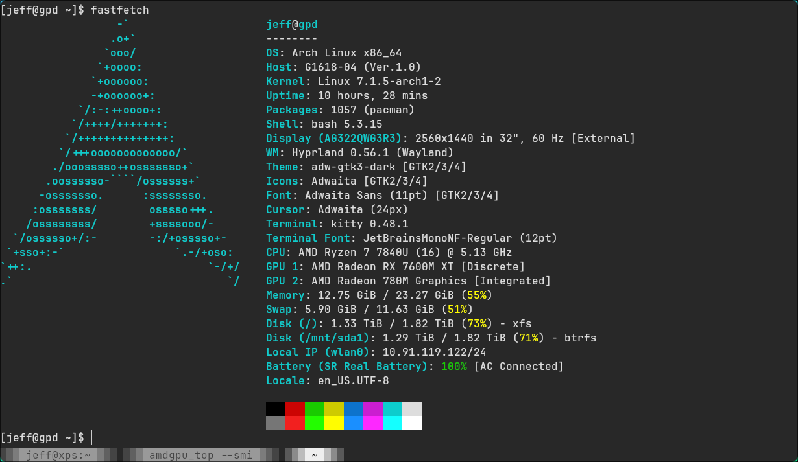
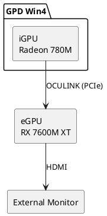

# Arch Linux + Hyprland on GPD Win4 with iGPU + eGPU



## Document Objective

Written for the GPD Win4's two AMD GPUs (iGPU + eGPU) on Arch Linux + hyprland.lua, offloading rendering onto the eGPU — but the approach generalizes, so it also serves as a reference for external-GPU setups on other hardware.

- Configuration guidance (iGPU only / with eGPU) — Hardware Stack
- Self-check commands to verify current state — Verification
- All relevant commands in one place — distributed across sections
- Tweak log: what's applied, what's proposed — Current State / Proposed
- Searchable wiki for later reference — the whole doc

> The objective doubles as the document structure: each bullet maps to a section below, in reading order.

## Hardware Stack
- OS: Arch Linux + Hyprland 0.56.1 (Lua config officially supported)
- 2 AMD GPUs: iGPU (Radeon 780M) + eGPU (RX 7600M XT, via OCULINK)
- BIOS: UMA frame buffer set to 8G (iGPU VRAM; Advanced > CBS > NBIO > GFX Configuration)

### 1. iGPU Only
- Both built-in and external monitors work
- Disabling any monitor works
- Single iGPU is primary

### 2. With eGPU



Expected:
- Turn on eGPU before powering on the machine
- Both monitors work
- iGPU is primary
- Run apps on the eGPU via command line

## Verification (quick self-check, run first)

```sh
lspci | grep -i 7600M                         # eGPU detected? bus id?
# stable offload check (derived id, not DRI_PRIME=1 which is index-relative)
DRI_PRIME="pci-0000_$(lspci | awk '/7600M/{print $1}' | tr '.:' '__')" glxinfo | grep -i renderer  # -> RX 7600M XT
egpu glxinfo | grep -i renderer               # same via wrapper
vulkaninfo --summary                          # both GPUs visible (--list-devices invalid)
hyprctl monitors all                          # active monitors per output
readlink -f ~/.config/hypr/cards/{egpu,igpu}  # symlink targets
```

Is the eGPU taking workload? While a game runs via `egpu <game>`, watch GPU busy %:

```sh
watch -n 1 'for g in egpu igpu; do n=/sys/class/drm/$(basename "$(readlink -f ~/.config/hypr/cards/$g)"); echo "$g: $(cat "$n/device/gpu_busy_percent")%"; done'
```

If the eGPU line is high (90%+ in a real game) while iGPU stays low, the eGPU is doing the work. Richer view (already installed): `amdgpu_top` or `amdgpu_top --smi`.

Example — a Steam game running on the eGPU (eGPU busy ~25%):


## Verified Hardware Mapping (Aug 2026, this boot)

| GPU | PCI id | vendor:device | /dev/dri | outputs |
|---|---|---|---|---|
| eGPU RX 7600M XT (Navi 33) | `03:00.0` | `1002:7480` | card1 / renderD128 | HDMI-A-1, DP-1, DP-2 |
| iGPU Radeon 780M (Phoenix) | `66:00.0` | `1002:15bf` | card2 / renderD129 | eDP-1 (built-in), DP-3..8 |

- `eDP-1` (GPD G1618-04) on iGPU; `HDMI-A-1` (AOC AG322QWG3R3) on eGPU — both already work with the eGPU attached.

> **IDs are per-boot snapshots, not promises.** `cardN`/`renderD*` and even PCI bus IDs can change randomly between reboots. Always resolve dynamically (`lspci`, `/dev/dri/by-path/`) or use the symlinks `~/.config/hypr/cards/{egpu,igpu}`.
>
> Verified evidence: in 3 of 8 boot logs the iGPU appeared at `63:00.0` (eGPU absent) instead of `66:00.0`. eGPU-present boots have been consistently `03:00.0`/`66:00.0`.

Regenerate the table (verified):

```sh
for c in /dev/dri/by-path/pci-*-card; do
    pci=$(basename "${c%-card}"); pci=${pci#pci-0000:}
    card=$(basename "$(readlink -f "$c")")
    render=$(basename "$(readlink -f "${c%-card}-render")")
    dev=$(lspci -nn -s "0000:$pci")
    vid=$(grep -oE '\[[0-9a-f]{4}:[0-9a-f]{4}\]' <<<"$dev" | tr -d '[]')
    name=$(sed -E 's/^[0-9:.]+ //; s/^VGA compatible controller \[0300\]: //; s/ \[[0-9a-f]{4}:[0-9a-f]{4}\] \(rev [0-9a-f]+\)$//' <<<"$dev")
    outs=$(ls -d /sys/class/drm/${card}-* 2>/dev/null | grep -v Writeback | sed "s|.*/${card}-||" | paste -sd,)
    printf "%s | %s | %s | %s / %s | %s\n" "$name" "$pci" "$vid" "$card" "$render" "$outs"
done
```

## Current State (Unchanged)

`~/.bashrc` has an `egpu()` launcher — GL-only offload with a hardcoded PCI id:

```sh
# egpu
# Custom eGPU launcher shortcut
egpu() {
    if [ -z "$1" ]; then
        echo "Usage: egpu <command>"
        echo "Example: egpu steam"
        return 1
    fi
    echo "Launching $1 on AMD Radeon RX 7600M XT..."
    # Explicitly target the eGPU's unchanging PCI identifier
    env DRI_PRIME="pci-0000_03_00_0" "$@"
}
```

Verified: `egpu glxinfo` -> `RX 7600M XT`; plain `glxinfo` -> `780M`.

How it works: `DRI_PRIME=pci-0000_<bus>_<dev>_<func>` renders GL/EGL on that GPU only; scanout is Hyprland's job. Per-command only — desktop stays on iGPU.

Not covered:
1. **Vulkan** — ignores `DRI_PRIME`; games enumerate both GPUs themselves.
2. **Display driving** — compositor decides scanout; already works (see mapping).
3. **Hardcoded PCI id** — matches now, may drift across boots.

## Stable DRM Symlinks (Set Up)

```sh
mkdir -p ~/.config/hypr/cards
ln -s /dev/dri/by-path/pci-0000:03:00.0-card  ~/.config/hypr/cards/egpu
ln -s /dev/dri/by-path/pci-0000:66:00.0-card  ~/.config/hypr/cards/igpu
```

`by-path` is PCI-stable, so the symlinks survive cardN shifts. Verified: `egpu`->card1, `igpu`->card2.

> Caveat: `igpu` (pointing at `66:00.0`) dangles in eGPU-absent boots — the iGPU then sits at `63:00.0`. Harmless as long as nothing references it.

## eGPU Display Ownership (Optional)

Env var for this stack is `AQ_DRM_DEVICES` (`WLR_DRM_DEVICES` is gone in Aquamarine 0.14+). In `~/.bash_profile`, igpu first = primary:

```sh
export AQ_DRM_DEVICES="$HOME/.config/hypr/cards/igpu:$HOME/.config/hypr/cards/egpu"
```

- Set before Hyprland starts (login shell); effective after logout/login
- Currently unset and monitors already work — only makes ownership deterministic

## Proposed `egpu()` Improvements (Not Applied)

1. **Resolve PCI id at call time.** `lspci` emits `03:00.0` with a dot — replace `[.:]`, not just `:`.

```sh
egpu() {
    if [ -z "$1" ]; then
        echo "Usage: egpu <command>"
        echo "Example: egpu steam"
        return 1
    fi
    local id
    id=$(lspci | awk '/7600M/ {print $1}')
    if [ -z "$id" ]; then
        echo "eGPU (RX 7600M XT) not detected" >&2
        return 1
    fi
    env DRI_PRIME="pci-0000_${id//[.:]/_}" "$@"
}
```

   Pros: no stale id, clear "not detected" error. Cons: one `lspci` call per run.

2. **Vulkan offload.** `MESA_VK_DEVICE_SELECT=1002:7480` (layer installed). Verified: reorders eGPU to GPU0 but does **not** hide the other GPU. Helps apps defaulting to the first adapter; name-picking apps unaffected.

## Open Questions (decided)

- **Is `03:00.0` stable?** Stable in all eGPU-present boots (5/5); iGPU moves to `63:00.0` when eGPU absent. Dynamic resolution stays as the safe default.
- **`MESA_VK_DEVICE_SELECT` in `egpu()`?** Optional nice-to-have — only helps Vulkan games without an in-game adapter picker. Not required.
- **Rename `egpu`?** Cosmetic only; keeping it is fine.
- **Enable `AQ_DRM_DEVICES`?** No — everything works, and the `igpu` symlink dangles in eGPU-absent boots, so enabling it adds risk with no current benefit.
